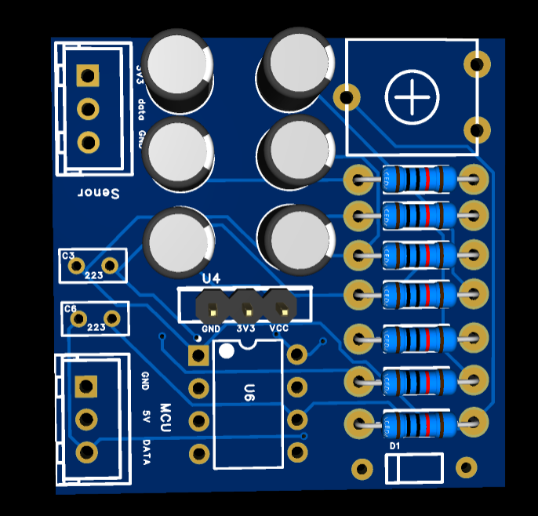
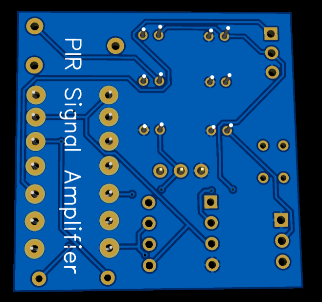

# 📡 Dự Án Nghiên Cứu & Thiết Kế Mạch Khuếch Đại Cảm Biến PIR Phiên Bản 2 (Low-Noise PIR Signal Amplifier v2)


---

## 📌 Tổng Quan Dự Án & Đặt Vấn Đề (Project Overview & Motivation)

Tín hiệu phát ra từ **cảm biến hồng ngoại thụ động (PIR Sensor)** khi phát hiện sự di chuyển của thân nhiệt con người có biên độ điện áp vô cùng nhỏ (cỡ $\mu V \sim mV$) và cực kỳ dễ bị ảnh hưởng bởi nhiễu môi trường, ánh sáng và nhiễu nguồn.

**Mục tiêu của dự án:** 
Nghiên cứu và chế tạo **Bo Mạch Khuếch Đại & Lọc Tín Hiệu PIR Phiên Bản 2 (PIR Amplifier Board v2)** trên công cụ **EasyEDA Pro**, ứng dụng kỹ thuật lọc dải thông tần số thấp ($0.7 \text{ Hz} - 10 \text{ Hz}$) kết hợp với các tầng khuếch đại thuật toán (Op-Amp) độ nhiễu thấp, giúp xử lý tín hiệu sạch trước khi đưa vào vi điều khiển (ESP32, STM32, Arduino).

---

## 📸 Mô Hình 3D Bo Mạch PCB (3D PCB Top & Bottom View)

<p align="center">
  
  
</p>

<p align="center">
  <i>Mô phỏng phối cảnh 3D bo mạch PCB 2 lớp: Mặt Trước (Top View) & Mặt Sau (Bottom View)</i>
</p>

---

## ⚡ Đặc Tính Kỹ Thuật Nổi Bật (Key Features & Highlights)

1. **Thiết Kế Chuẩn Kỹ Thuật Trên EasyEDA Pro:** 
   - Sử dụng phiên bản EasyEDA Pro mới nhất, quản lý dự án theo cấu trúc mô-đun chuyên nghiệp.
   - Sẵn file dự án gốc `.epro2` giúp dễ dàng tùy biến, mô phỏng và mở rộng.
2. **Lọc Dải Thông & Loại Bỏ Nhiễu DC Drift:** 
   - Tích hợp tầng lọc dải thông chủ động cắt dải tần cao ($>10 \text{ Hz}$) và dải tần quá thấp ($<0.7 \text{ Hz}$) để loại bỏ báo động giả do thay đổi nhiệt độ môi trường.
3. **Sẵn Sàng Sản Xuất & Tích Hợp Mô Hình 3D (CAD/CAM Integration):** 
   - Xuất đầy đủ bộ file gia công PCB (Gerber 2026), bảng linh kiện BOM Excel và file **3D STEP CAD (`.step`)** cho phép phối hợp thiết kế vỏ hộp 3D chuyên nghiệp.

---

## 🧩 Sơ Đồ Khối Hệ Thống (System Block Diagram)


---

## 📊 Thông Số Kỹ Thuật Chi Tiết (Specifications Table)

| Thông Số (Parameter) | Giá Trị (Value) | Ghi Chú Kỹ Thuật (Notes) |
| :--- | :--- | :--- |
| **Công Cụ Thiết Kế (EDA)** | `EasyEDA Pro Edition` | Quản lý dự án dạng `.epro2` |
| **Điện Áp Cấp Nguồn (VCC)** | `3.3V - 5.0V DC` | Tích hợp mạch ổn áp nội bộ |
| **Băng Thông Lọc (Bandwidth)** | `0.7 Hz - 10 Hz` | Tần số quét chuyển động thân nhiệt |
| **Dạng Tín Hiệu Đầu Ra** | `Analog (Vout) / Digital Trigger` | Kết nối trực tiếp chân ADC / Interrupt |
| **Quy Cách PCB (PCB Specs)** | `2-Layer FR4, 1.6mm` | Phủ sơn chống oxy hóa (Hasl / ENIG) |
| **Định Dạng 3D CAD** | `STEP (.step) & OBJ (.obj)` | Tương thích SolidWorks, Fusion 360 |

---

## 📂 Cấu Trúc Thư Mục Dự Án (Repository Directory Map)

```text
Mach_Khuech_Dai_PIR2/
├── hardware/                         # Toàn bộ thiết kế phần cứng EasyEDA Pro
│   ├── schematics/                   # Bản vẽ sơ đồ nguyên lý chuẩn PDF
│   │   └── SCH_Schematic1_2026-09-04.pdf
│   ├── gerber/                       # File nén Gerber đặt làm PCB tại xưởng
│   │   └── Gerber_PCB1_2026-09-04.zip
│   ├── production/                   # Bảng thống kê danh mục linh kiện (BOM)
│   │   └── BOM_Board1_Schematic1_2026-09-04.xlsx
│   ├── easyeda_source/               # File dự án nguồn EasyEDA Pro gốc (.epro2)
│   │   └── ProPrj_mach_khuech_dai_tin_hieu_cam_bien_PIR_2026-09-04.epro2
│   └── 3d_model/                     # Mô hình 3D CAD (.step)
│       └── 3D_PCB1_2026-09-04.step
├── docs/                             # Thư mục chứa tài liệu & Hình ảnh trình diễn
│   ├── pcb3d_mt.png                  # Ảnh mô phỏng 3D Mặt Trước bo mạch
│   └── pcb3d_ms.png                  # Ảnh mô phỏng 3D Mặt Sau bo mạch
├── .gitignore                        # Cấu hình bỏ qua file tạm hệ thống
├── LICENSE                           # Giấy phép bản quyền nguồn mở MIT
└── README.md                         # Tài liệu thuyết minh dự án
```

---

## 🛠️ Hướng Dẫn Gia Công Sản Xuất & Mở Dự Án (Getting Started)

1. **Mở Dự Án Trên EasyEDA Pro:** 
   - Khởi động EasyEDA Pro, chọn `File` -> `Open` -> `EasyEDA Pro` và mở file `hardware/easyeda_source/ProPrj_mach_khuech_dai_tin_hieu_cam_bien_PIR_2026-09-04.epro2`.
2. **Gia Công Bo Mạch PCB:** 
   - Tải file `hardware/gerber/Gerber_PCB1_2026-09-04.zip` để nạp lên xưởng in mạch (JLCPCB, PCBWay, Kim Sơn,...).
3. **Phối Cảnh Thiết Kế Vỏ Hộp 3D:** 
   - Nhập file `hardware/3d_model/3D_PCB1_2026-09-04.step` vào phần mềm SolidWorks / Fusion 360 để thiết kế vỏ hộp bảo vệ.

---

## 📜 Giấy Phép (License)

Dự án được phân phối dưới giấy phép [MIT License](LICENSE) - Cho phép tự do nghiên cứu, học tập, chỉnh sửa và thương mại hóa.

---
*Dự án được thực hiện bởi **Viet Hoang Luong**.*
